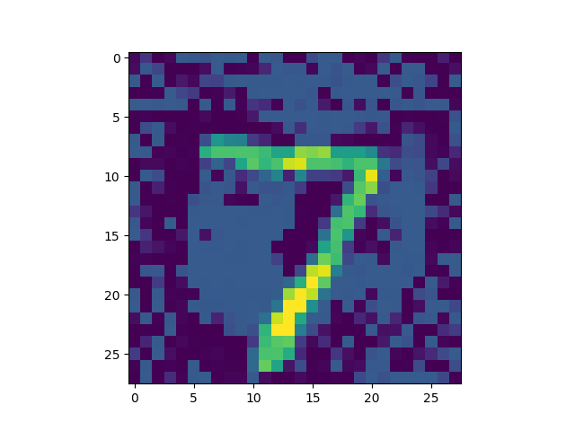

# SDP Neural Network Verification Methods
Adversarial attacks cause serious problem in practice. For example, the following picture will be classified as "0" in the neural network. In safety-critical areas like autonomous driving, such a mis-classification may cause traffic accident



Therefore, we aim to solve the **neural network verification problem**. That is, given the weights, bias, sample and an epsilon, verifying a neural network's robustness to adversarial attacks

In my thesis, we focus on SDP relaxation methods for solving the problem. Here are some famous SDP relaxation methods for solving neural network verification problem and their original papers
## 1. DeepSDP
Mahyar Fazlyab, Manfred Morari, George J. Pappas, [Safety Verification and Robustness Analysis of Neural Networks via Quadratic Constraints and Semidefinite Programming](https://arxiv.org/abs/1903.01287)
## 2. SDR
Raghunathan A, Steinhardt J, Liang P. [Semidefinite relaxations for certifying robustness to adversarial examples. arXiv preprint arXiv:1811.01057. 2018 Nov 2](https://arxiv.org/abs/1811.01057).
## 3. Layer SDP
B. Batten, P. Kouvaros, A. Lomuscio, Y. Zheng. [Efficient Neural Network Verification via Layer-based Semidefinite Relaxations and Linear Cuts](https://www.ijcai.org/proceedings/2021/0301.pdf). Proceedings of the 30th International Joint Conference on Artificial Intelligence (IJCAI21). Montreal, Canada.
## 4. SDPNET
SDPNET is proposed in my thesis. It can provide a provably tighter relaxation bound over the other SDP relaxation methods.

Tightness comes from the following aspects:
1. Add a linear cut to the constraint set
2. repeated non-linearity constraints
3. Apply CROWN as the interval propagation method

To use our method, you need to install the following packages & solver
```text
numpy
tensorflow
jax_verify
sklearn
matlab.engine

mosek
yalmip
```
The following command will launch a verification on MNIST dataset with PGDNN (Raghunathan et al., 2018)
```shell
python index.py --dataset MNIST --nnfile model/raghunathan18_pgdnn.pkl --eps 0.1 --dims "[784, 200, 100, 50, 10]" --method "sdpnet" --num 30 --input_bounds "(0., 1.)" --output mnist_log.txt
```

If you want to self-train a neural network and verify it, we provide a `train.py` method to train a neural network and generate the required files
```shell
python train.py --dataset iris --dims "[4, 5, 10, 20, 30, 40, 3]"
python index.py --dataset iris --nnfile params.pkl --eps 0.075 --dims "[4,5,10,20,30,40,3]" --num 30 --input_bounds "(0., 10.)" --method "sdpnet"   --output iris_log.txt
```

Currently, we support benchmarks such as MNIST, Iris and Auto-taxi.

In this repository, we have included some additional directories such as MOSEK and YALMIP. If you have installed these packages on your computer, you could just delete these files and remove the `eng.init()` function  in `test.py`


